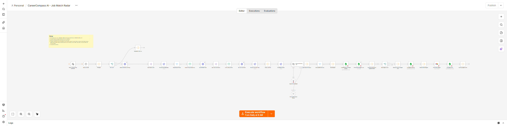

# CareerCompass AI

Every day at 8:00 AM Manila time, or on a manual run, score recent hiring posts for a candidate, save strong matches, send one digest, and stop.

These images show a local n8n editor. Red icons mean credentials still need to be connected on your own instance.

[Search and checks](screenshots/n8n-start.png) · [Match and digest steps](screenshots/n8n-finish.png)

## What it does

The workflow reads the configured Hacker News hiring thread and item API, checks job text against the candidate profile, asks OpenAI to score likely matches, and saves them in Job Matches. It emails a daily digest when matches exist. It does not apply to jobs, contact employers, or promise that a role accepts Philippine applicants. The candidate must check remote eligibility, salary currency, and every generated cover letter. No peso conversion is invented for a foreign salary.

Success means Job Matches rows keyed by HN Item ID and, when there are matches, one Digest Runs row for the Manila date and one Gmail digest. The candidate owns this workflow.

## Set up

1. On self-hosted n8n, import CareerCompass AI.json and Failure Alert.json. Connect OpenAI, Google Sheets, and Gmail credentials. Restrict the Google account to the candidate's sheet and inbox.
2. Make a Job Matches tab with: Date, Company, Role, Location, Work Mode, Salary, Match Score, Match Reasons, Missing Skills, Email Subject, Cover Letter, Apply URL, Company URL, HN Item ID, Status. Make a Digest Runs tab with: Date, Run ID, Count, Status.
3. Set JOBHUNT_SHEET_ID, JOBHUNT_EMAIL_TO, JOBHUNT_PROFILE, JOBHUNT_SEARCH_URL, JOBHUNT_ITEM_API_BASE, and CAREER_ALERT_EMAIL_TO in the server environment. JOBHUNT_PROFILE must truthfully say the candidate is based in the Philippines and describe skills and work eligibility. Suggested starting URLs are https://hn.algolia.com/api/v1/search_by_date?query=%22Ask%20HN%3A%20Who%20is%20hiring%22&tags=story&hitsPerPage=30 and https://hacker-news.firebaseio.com/v0/item. Keep API keys in n8n credentials. Set N8N_BLOCK_ENV_ACCESS_IN_NODE=false on this dedicated instance.
4. In the main workflow's n8n Settings, choose Failure Alert as its Error Workflow. Connect its Gmail node and test delivery. Optional limits: CAREER_MAX_JOBS=10 and CAREER_MIN_SCORE=75. Set N8N_CONCURRENCY_PRODUCTION_LIMIT=1 to reduce overlapping scheduled runs; manual runs can still overlap.

CAREER_ENABLED=true allows a run. Dry run is on unless CAREER_DRY_RUN=false. Dry run stops before public APIs, OpenAI, Sheets, and Gmail. Set CAREER_ENABLED=false and deactivate the workflow to stop new runs.

## Test before using real job data

1. Run python smoke_test.py after edits. It exits nonzero on failure. GitHub Actions runs it on pushes and pull requests.
2. Enable the flag and leave dry run on. Run manually; confirm dry_run and no external calls.
3. Use a test sheet and inbox, set CAREER_DRY_RUN=false, and run against a small known hiring thread. Check the rows, location filtering, and digest. Run again on the same Manila date; check that no second digest appears.
4. Test an empty search result, a network failure, and Failure Alert delivery.

## If something fails

n8n logs the time, run ID, and result; Failure Alert emails CAREER_ALERT_EMAIL_TO. Job Matches upserts by HN Item ID. Digest Runs is marked Attempted before Gmail and Sent afterward. Attempted means delivery is uncertain. Check the execution and Gmail Sent before changing that row. Only remove the marker and rerun after deciding a resend is needed; Gmail may have sent despite a timeout.

The workflow has a 900 second run limit, 15 second HTTP timeouts, and a 30 second AI timeout. The three HTTP attempts use a fixed two second wait, and n8n's generic retry can retry a permanent HTTP error; this is not selective backoff. Sheet and Gmail writes are not retried after an uncertain result. Sheets has no atomic unique key, so simultaneous runs can duplicate rows or digests. Keep one run at a time and reconcile if needed.

If n8n is offline at 8:00 AM, the scheduled run is missed. Run it manually after recovery. Use an outside uptime monitor. Review the profile, job source, owner, and inbox every quarter; retire the workflow when the job search ends. Test with live account connections before relying on the digest.

## Go-live check

- [ ] Dry run was tested; it touched no live account.
- [ ] Secrets are in n8n credentials, and required environment settings are present.
- [ ] The same item was run twice in a test account with no duplicate side effect.
- [ ] Timeouts and retry limits were checked; uncertain Gmail or Sheets writes are reviewed by a person.
- [ ] Failure Alert reaches the named operator, and an outside monitor covers n8n outages.
- [ ] The operator knows how to set CAREER_ENABLED=false and deactivate the workflow.\n
