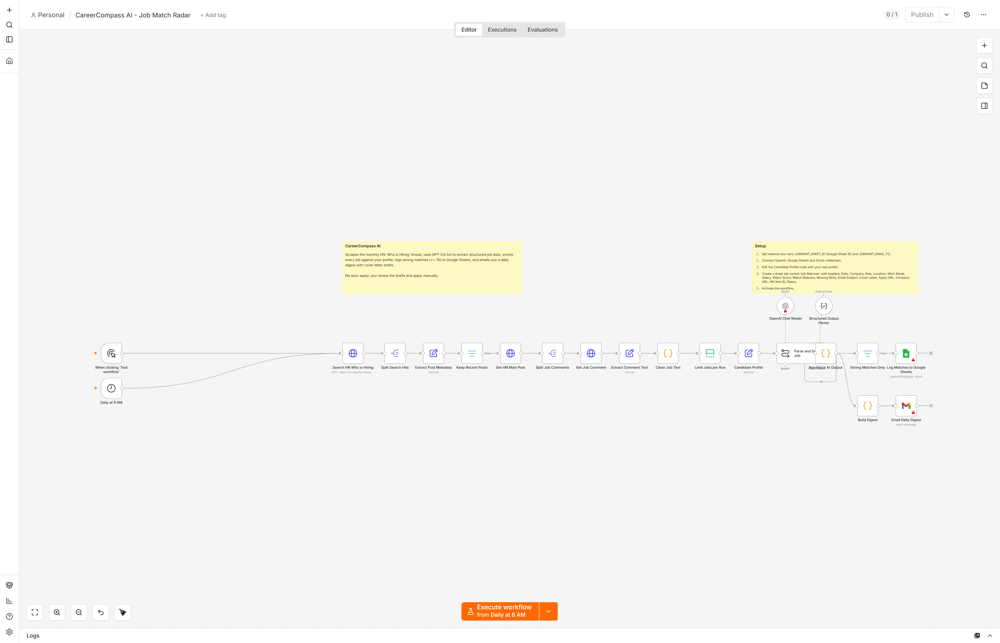
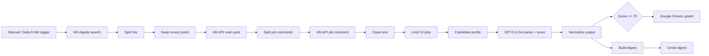

# CareerCompass AI

An n8n automation that finds jobs worth applying to, scores them against your real profile, drafts a cover letter for each strong match, tracks everything in Google Sheets, and emails you a daily digest.



## What it does

1. Searches Hacker News for the monthly "Who is hiring?" thread.
2. Pulls the individual job comments from the HN API.
3. Cleans the raw HTML text.
4. Sends each job + your profile to GPT-5.6 Sol with a strict JSON schema.
5. Extracts structured fields: company, title, location, salary, apply URL, match score, match reasons, missing skills, email subject, and a cover letter draft.
6. Upserts every strong match (score >= 75) to a Google Sheet, keyed on `HN Item ID`, so daily runs don't create duplicates.
7. Emails you a digest with the strongest matches and their cover letter drafts.

No auto-apply. The AI prepares the work; you review and send. That keeps applications honest and gives you control.

## Files

- `CareerCompass AI.json` - importable n8n workflow
- `README.md` - this guide

## Architecture



## Setup

1. Import the workflow:
   - n8n -> Workflows -> Import from File -> `CareerCompass AI.json`

2. Set environment variables in n8n:

   | Variable | Purpose |
   |---|---|
   | `JOBHUNT_SHEET_ID` | Google Sheets document ID |
   | `JOBHUNT_EMAIL_TO` | Email address that receives the digest |
   | `JOBHUNT_PROFILE` | Optional override for the candidate profile |

   Self-hosted n8n: add them to the container env or `.env`.
   n8n Cloud: Settings -> Environment Variables.

3. Connect credentials:
   - OpenAI (Chat Model node)
   - Google Sheets (Log Matches node)
   - Gmail OAuth2 (Email Digest node)

4. Edit the `Candidate Profile` node with your real details: target role, skills, years of experience, location, remote preference.

5. Create a Google Sheet tab named `Job Matches` with these headers:

   ```
   Date, Company, Role, Location, Work Mode, Salary, Match Score, Match Reasons, Missing Skills, Email Subject, Cover Letter, Apply URL, Company URL, HN Item ID, Status
   ```

   `Status` is optional and not overwritten by the workflow, so you can manually track Applied / Interview / Rejected.

6. Test the workflow once with the "Test workflow" button. Then activate it.

## Cost note

Default run processes 10 jobs with `gpt-5.6-sol`. Raise `Limit Jobs per Run` if you want more coverage.

## Ideas to extend it

- Add a second job source (RemoteOK API, Greenhouse/Ashby feeds).
- Add a Telegram or Slack channel for instant alerts.
- Add an n8n form so you can mark a match as "Applied", "Interview", or "Rejected" and update the sheet.
- Use a vector store to compare jobs against your resume instead of a static profile string.
